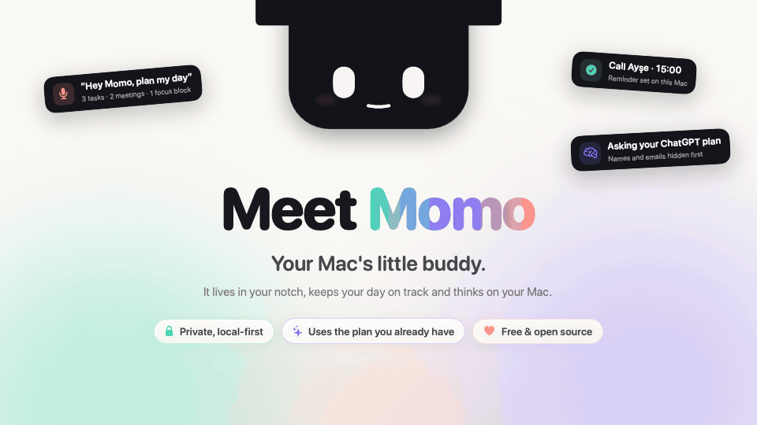
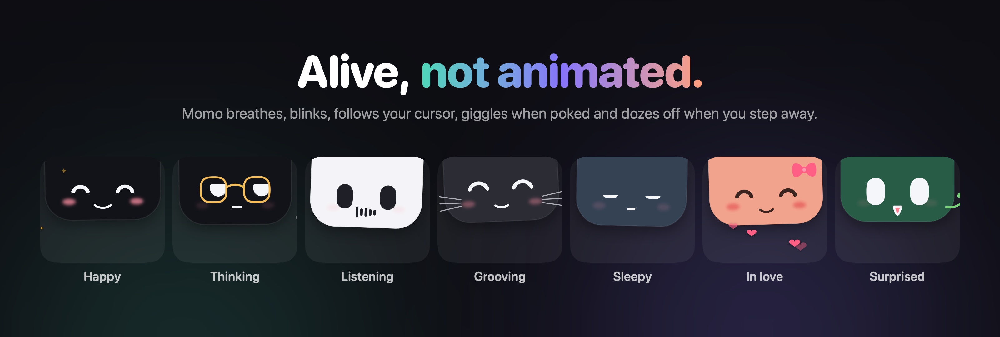
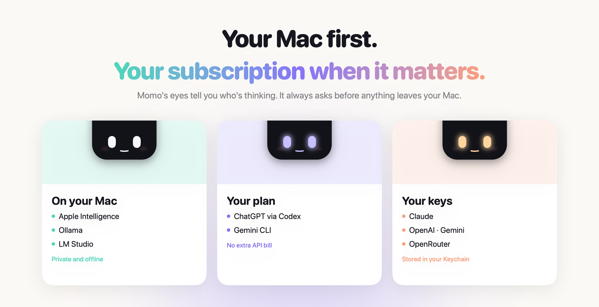
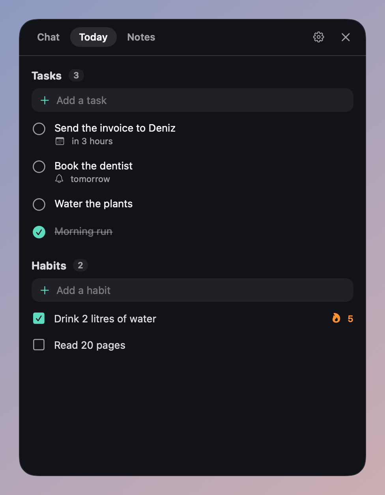
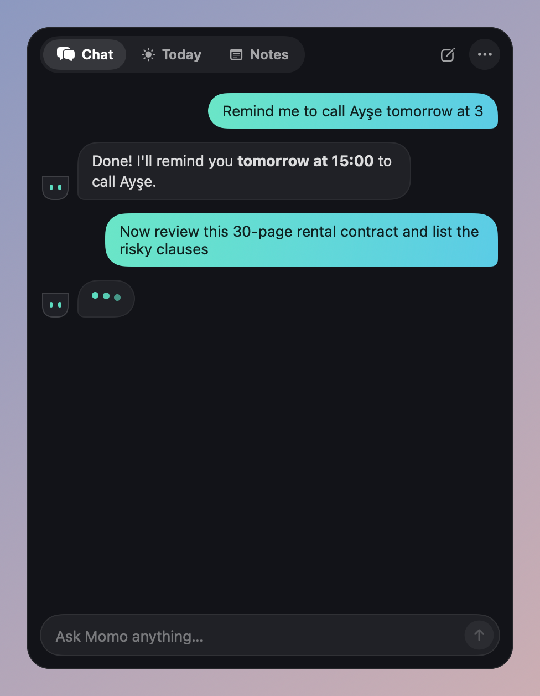
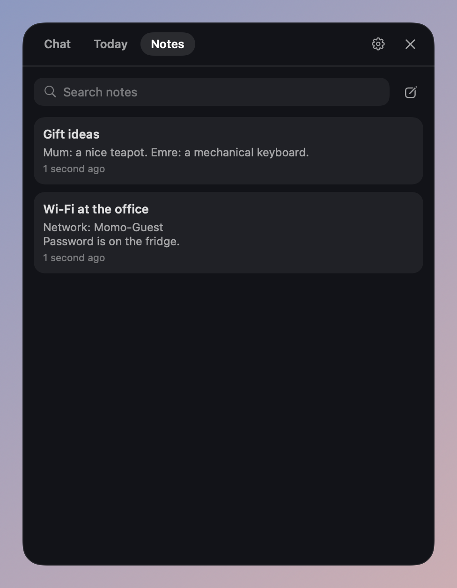
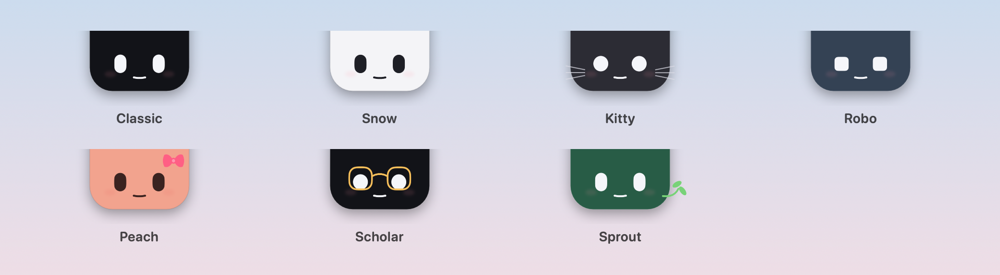

<p align="center">
  
</p>

# Momo

[](https://github.com/uemrey0/momo/actions/workflows/ci.yml)
[](LICENSE)


**A tiny, living companion that sits in your Mac's notch and gets things done.**

Momo keeps your tasks, notes and habits, remembers what matters to you and answers questions,
privately on your Mac whenever it can. When a job needs a bigger brain, it asks before
borrowing the ChatGPT or Gemini plan you already pay for, or an API key you bring. There is no
Momo server, no account and no subscription.



## Why Momo

- **It feels alive.** Momo breathes, blinks, glances at your cursor, giggles when you poke it,
  dozes off when you step away, dances when music plays and yawns when it gets late. Every
  motion is procedural, so it never loops the same way twice.
- **Local first.** Apple Intelligence, Ollama or LM Studio answer everyday requests on your
  Mac. Tasks, notes, memories and voice all work offline.
- **Your own subscription.** Bigger jobs can go to ChatGPT through the official Codex CLI or to
  Gemini through the Gemini CLI, signed in with *your* account, or to Claude, OpenAI, Gemini or
  OpenRouter with your API key. Momo always asks first.
- **Private by default.** Before anything leaves your Mac, emails, phone numbers, IBANs, card
  numbers, national ID numbers and names are replaced with placeholders, and put back in the
  answer. A log shows everything that was sent.
- **Does things, not just talks.** Tasks with reminders, notes, habits with streaks, calendar
  events, focus sessions, opening apps and links, running Shortcuts, reading the screen (when
  you ask). Anything irreversible needs your OK.
- **Talk to it.** Press ⌥⇧Space or say "Hey Momo". Replies are read aloud in their own language
  and Momo's mouth moves with every word.
- **Works with your agents.** Momo ships an MCP server, so Claude, Codex and other agents can
  use your tasks and notes, and it can use your own MCP servers too.
- **Speaks your language.** English and Turkish today; translations are a single file.
- **Make it yours.** Seven looks built in, and your own with a few lines of JSON.



<p align="center">
  
  
  
</p>



## Get started

### Install

Download the latest `Momo-x.y.z.dmg` from
[Releases](https://github.com/uemrey0/momo/releases), open it and drag Momo into
Applications. If macOS says the app is from an unidentified developer, right-click Momo and
choose **Open** once.

Or build it yourself (Xcode 16 or later):

```bash
git clone https://github.com/uemrey0/momo.git
cd momo
make app      # builds dist/Momo.app
open dist/Momo.app
```

### Give Momo a brain

Momo walks you through this on first launch; everything lives in **Settings → AI**. Pick an
option, press **Connect** and follow the steps. None of them need Terminal.

| Brain | What you need |
| ----- | ------------- |
| Apple Intelligence | macOS 26 with Apple Intelligence turned on. Nothing to install. |
| Ollama | The free [Ollama](https://ollama.com) app. Momo downloads a model for you. |
| LM Studio | The free [LM Studio](https://lmstudio.ai) app with its server switched on |
| ChatGPT plan | Sign in with ChatGPT. Momo uses the ChatGPT app's Codex or downloads the official Codex tool. |
| Google account | Sign in with Google. Momo downloads Google's official Gemini CLI. No API key, no extra charges. |
| Claude, OpenAI, Gemini API, OpenRouter | An API key; copy it and Momo picks it up and checks it |

Claude subscriptions can't be used by third-party apps. To use your Claude plan with Momo,
connect Momo to Claude instead (below).

### Use it

| Shortcut | What it does |
| -------- | ------------ |
| ⌥Space | Open or close the panel |
| ⌥⇧Space | Talk to Momo |
| Click Momo | Open the panel (and tickle it) |
| "Hey Momo" | Optional wake word (Settings → Voice) |

Try "Remind me to call Ayşe tomorrow at 3", "What's on my calendar today?", "Start a 25-minute
focus session", "Note that the Wi-Fi password is on the fridge" or "What's on my screen?".

### Use Momo from Claude, Codex and other agents

In **Settings → Connections**, press **Add to Claude Desktop**, **Add to Claude Code** or
**Add to Codex**. For other agents, add an MCP server that runs
`/Applications/Momo.app/Contents/MacOS/momo-mcp`. Tools that delete data are only offered with
`--allow-destructive`.

## Privacy

- Requests go to a remote brain only when needed, and Momo asks first (you can allow a whole
  conversation, or turn on local-only mode).
- Personal details are masked before they leave your Mac and restored locally.
- API keys stay in your Keychain; Codex and Gemini keep their own credentials, which Momo never
  reads.
- Speech is recognised on your Mac. The screen is only read when you ask, with confirmation.
- No telemetry. The only other network request is a daily update check against GitHub, which
  you can turn off.

Your data is a single JSON file in `~/Library/Application Support/Momo`.

## Project layout

```
Sources/
  MomoFace/    Character engine, renderer and character packs (no dependencies)
  MomoKit/     Data store, tools, personal data masking, brain router
  MomoBrain/   Brain providers, CLI bridges and the assistant
  MomoVoice/   Speech recognition, speech synthesis and the wake word
  MomoMCP/     MCP server and client
  momo-mcp/    The MCP server command shipped inside the app
  MomoApp/     The macOS app
Tests/         Swift Testing suites for every library
docs/          Architecture, roadmap, ADRs and guides
Scripts/       Build, packaging, icon and localization scripts
```

Read the [architecture overview](docs/architecture.md), the
[character engine guide](docs/character-engine.md) and the
[character pack format](docs/character-packs.md).

## Contributing

Contributions are very welcome: code, translations, character packs, docs and bug reports.
Start with [CONTRIBUTING.md](CONTRIBUTING.md) and the [Code of Conduct](CODE_OF_CONDUCT.md).
Security issues go through [SECURITY.md](SECURITY.md).

```bash
make test       # run the tests
make run        # launch from the command line
make lint       # check formatting
make l10n       # check translations
make snapshots  # regenerate the README images
```

## Acknowledgements

Momo is inspired by [Taby](https://www.heytaby.com/). It is an independent project and is not
affiliated with Taby, Apple, OpenAI, Google or Anthropic.

## License

[Apache License 2.0](LICENSE)
