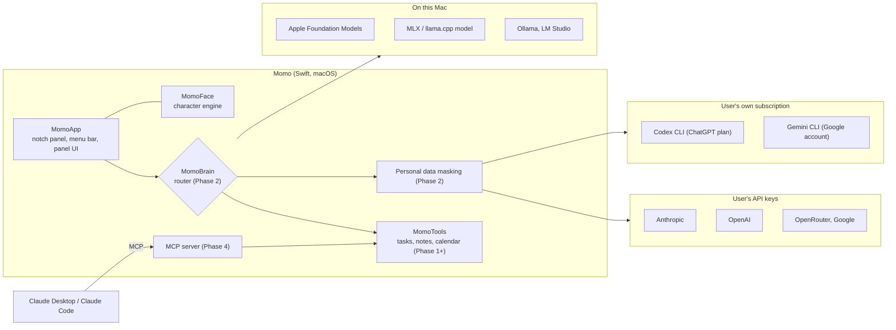

# Architecture

This document describes how Momo is put together. It covers the target architecture; modules
that don't exist yet are marked with the phase that introduces them.

## Overview

## Modules

| Module      | Kind                | Responsibility                                                    | Phase |
| ----------- | ------------------- | ----------------------------------------------------------------- | ----- |
| `MomoFace`  | Library             | Procedural character engine and SwiftUI renderer                  | 0     |
| `MomoApp`   | Executable          | App lifecycle, notch panel, menu bar, settings, localization      | 0     |
| `MomoTools` | Library             | Tasks, notes, reminders, habits, calendar, MCP server and client  | 1, 4  |
| `MomoBrain` | Library             | Provider adapters, brain router, personal data masking            | 1, 2  |
| `MomoVoice` | Library             | Wake word, speech recognition, speech synthesis, lip sync         | 3     |

Dependencies point one way: `MomoApp` depends on everything, and library modules never depend
on `MomoApp`. `MomoFace` has no dependencies and can be reused by other apps.

## MomoFace

The character is drawn procedurally, not from pre-rendered frames. See
[ADR 0004](adr/0004-procedural-character-engine.md) and
[the character engine guide](character-engine.md).

- `Spring`: a damped spring. Every visual property eases towards its target through one.
- `FaceChannel`: the animatable properties (gaze, eye size, lids, smile, squash, sway...).
- `Mood`: persistent emotional states that set channel targets.
- `FaceAction`: one-shot behaviours such as yawning or peeking into the notch.
- `FaceEvent`: things that happen on the Mac (meeting soon, low battery) mapped to reactions.
- `FaceEngine`: combines the layers every frame and produces a `FaceState` snapshot.
- `FaceRenderer` / `FaceView`: draw a `FaceState` with SwiftUI `Canvas`.

The engine advances inside the view's `TimelineView`, so it stops using CPU whenever the
character isn't on screen.

## MomoApp

- `NotchPanel`: a borderless, non-activating `NSPanel` above the menu bar that joins all
  Spaces and full-screen apps. It ignores mouse events except over the character's body, so it
  never blocks clicks on the menu bar.
- `ScreenGeometry`: finds the notch using `NSScreen.auxiliaryTopLeftArea` and
  `auxiliaryTopRightArea`. On displays without a notch, Momo hangs from the top centre and
  draws its own notch cap.
- `CharacterController`: owns the engine and the panel, feeds cursor position and system idle
  time into the engine, and exposes controls to the menu bar.

## Brain routing (Phase 2)

Each request passes these checks in order. The first rule that matches decides.

1. **Privacy lock.** "Local only" mode or a private conversation never leaves the Mac.
2. **Availability.** Which brains are reachable: network, CLI sign-ins, API keys, remaining
   plan limits.
3. **Capability.** Image generation, deep web research or documents too long for the local
   model need a remote brain, after the user confirms.
4. **Difficulty.** The local model classifies the intent and a difficulty from 1 to 5. Levels
   4 and 5 suggest a remote brain, after the user confirms. The threshold is configurable.
5. **Personal data masking.** Names, national ID numbers, IBANs, emails and phone numbers are
   masked before sending and restored locally in the answer.
6. **Local failure.** If local tool calls fail twice, Momo offers to retry remotely.

The eye colour shows which brain is active, and a log lists everything that left the Mac.

## Privacy principles

- Local by default; remote only with consent, and personal data masked.
- Credentials stay in the macOS Keychain or in the official CLIs; Momo never reads CLI tokens.
- No telemetry. Crash reports are opt-in and user-reviewed.
- Irreversible actions (sending, deleting, paying) always require confirmation.
