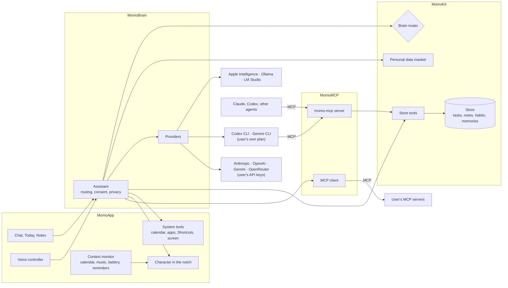

# Architecture

Momo is a native Swift app built from small library modules. This document explains how they
fit together; the [ADRs](adr/README.md) explain why.

## Overview

## Modules

| Module      | Kind       | Responsibility                                                         | Depends on        |
| ----------- | ---------- | ---------------------------------------------------------------------- | ----------------- |
| `MomoFace`  | Library    | Character engine, SwiftUI renderer, character packs                    | nothing           |
| `MomoKit`   | Library    | Store, tools, JSON values, personal data masking, brain router, versions | nothing         |
| `MomoBrain` | Library    | Providers, CLI bridges, the assistant, system prompt, brain settings   | MomoKit           |
| `MomoVoice` | Library    | Speech recognition, speech synthesis, wake word                        | nothing           |
| `MomoMCP`   | Library    | MCP server and client                                                  | MomoKit           |
| `momo-mcp`  | Executable | Serves Momo's store over stdio MCP; shipped inside the app bundle      | MomoMCP, MomoKit  |
| `MomoApp`   | Executable | The app: notch, panel, settings, voice, context, system tools          | everything        |

Library modules never depend on the app, contain no AppKit code except where the job is
inherently Mac-specific, and are covered by Swift Testing suites.

## How a message flows

1. The panel (or the voice controller) calls `AssistantController.send`.
2. The controller builds an `Assistant.Configuration`: the enabled providers from
   `BrainCatalog`, a `Toolbox` with the store tools, system tools and tools from connected
   MCP servers, the routing policy and the system prompt (persona, time, memories).
3. `Assistant` checks each provider's availability and asks `BrainRouter` for a decision:
   the user's explicit choice, the local-only lock, availability, length, and an estimated
   difficulty from 1 to 5 (`DifficultyEstimator`).
4. For a remote brain it asks the user for consent (once, for the conversation, or stay local)
   and masks personal data in the instructions, history and every tool result.
5. The provider streams text and runs tool calls through the assistant's `ToolRunner`, which
   restores masked values in the arguments, asks for confirmation when the tool needs it, and
   masks the output.
6. Events stream back to the UI; the character thinks, speaks (with lip sync when replies are
   read aloud) and celebrates when tasks are added or completed.

## Providers

| Provider | Kind | How |
| -------- | ---- | --- |
| `AppleIntelligenceProvider` | local | Foundation Models (macOS 26); tools bridged with dynamic schemas |
| `OpenAICompatibleProvider` | local or API key | Chat Completions streaming with function calling: Ollama, LM Studio, OpenAI, Gemini, OpenRouter |
| `AnthropicProvider` | API key | Messages API streaming; replays thinking and tool use blocks; handles refusals |
| `CodexProvider` | subscription | `codex exec --json` in a read-only sandbox, with `momo-mcp` offered for tools |
| `GeminiCLIProvider` | subscription | `gemini --output-format json` |

Every provider implements `ChatProvider`: `availability()` and
`respond(to:runTool:) -> AsyncThrowingStream<ChatEvent, Error>`.

## The character

`MomoFace` draws the character procedurally: every visual property is a spring-driven
channel, and five layers (life, mood, action, reaction, particles) set their targets each
frame. See the [character engine guide](character-engine.md) and
[character packs](character-packs.md).

In the app, `CharacterController` hosts the face in a borderless `NSPanel` above the menu bar,
sized to the hardware notch (`NotchGeometry`), and lets clicks through everywhere except the
body. Moods come from three places, in order of priority: the conversation (thinking,
speaking), the mood the user picked, and the ambient mood (music, focus).

## Data and privacy

- `MomoStore` keeps everything in `~/Library/Application Support/Momo/data.json`, written
  atomically and reloaded when another process (`momo-mcp`) changes it.
- API keys live in the Keychain (`KeychainStore`); CLI tools keep their own credentials.
- Remote requests are logged (brain, time, size, whether masking was on) in the Privacy tab.
- Irreversible or sensitive tools (deleting, running Shortcuts, adding calendar events,
  reading the clipboard or the screen) require confirmation in the chat.
