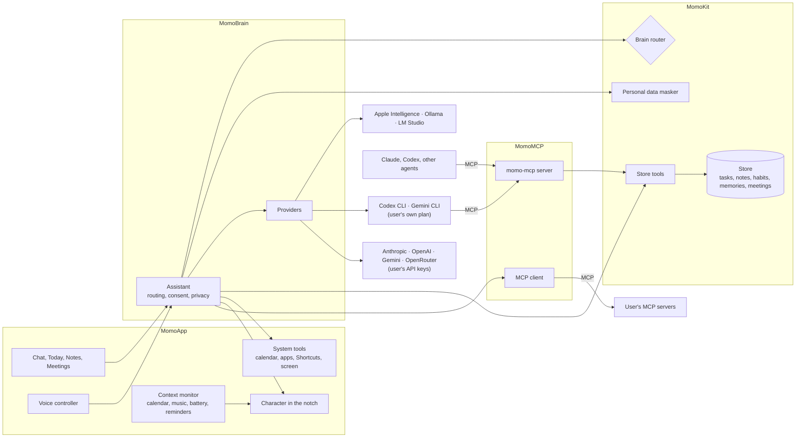
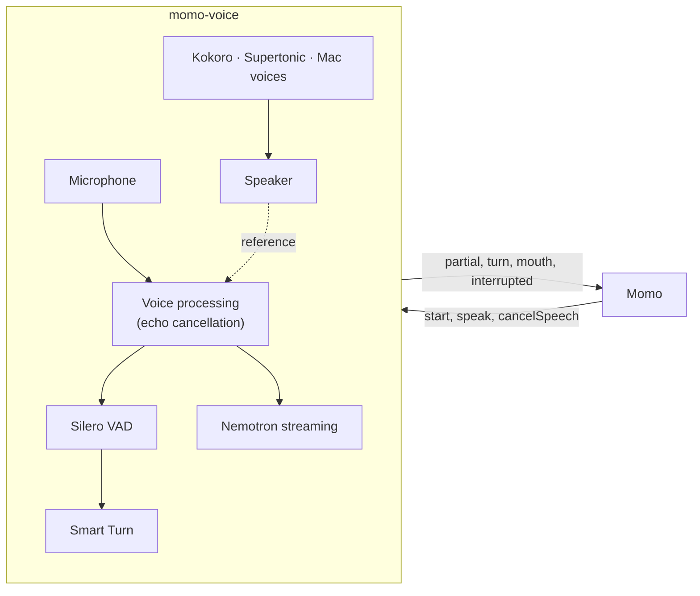

# Architecture

Momo is a native Swift app built from small library modules. This document explains how they
fit together; the [ADRs](adr/README.md) explain why.

## Overview

```mermaid
flowchart LR
  subgraph App["MomoApp"]
    Face["Character in the notch"]
    Panel["Chat, Today, Notes, Meetings"]
    Voice["Voice controller"]
    Context["Context monitor\ncalendar, music, battery, reminders"]
    System["System tools\ncalendar, apps, Shortcuts, screen"]
  end
  subgraph Brain["MomoBrain"]
    Assistant["Assistant\nrouting, consent, privacy"]
    Providers["Providers"]
  end
  subgraph Kit["MomoKit"]
    Store[("Store\ntasks, notes, habits, memories, meetings")]
    Tools["Store tools"]
    Router{"Brain router"}
    Masker["Personal data masker"]
  end
  subgraph MCP["MomoMCP"]
    Server["momo-mcp server"]
    Client["MCP client"]
  end
  Local["Apple Intelligence · Ollama · LM Studio"]
  Sub["Codex CLI · Gemini CLI\n(user's own plan)"]
  Keys["Anthropic · OpenAI · Gemini · OpenRouter\n(user's API keys)"]
  Agents["Claude, Codex, other agents"]
  Theirs["User's MCP servers"]

  Panel --> Assistant
  Voice --> Assistant
  Assistant --> Router
  Assistant --> Masker
  Assistant --> Providers
  Providers --> Local
  Providers --> Sub
  Providers --> Keys
  Assistant --> Tools
  Assistant --> System
  Tools --> Store
  Context --> Face
  Assistant --> Face
  Agents -- MCP --> Server --> Tools
  Sub -- MCP --> Server
  Client -- MCP --> Theirs
  Assistant --> Client
```

## Modules

| Module      | Kind       | Responsibility                                                         | Depends on        |
| ----------- | ---------- | ---------------------------------------------------------------------- | ----------------- |
| `MomoFace`  | Library    | Character engine, SwiftUI renderer, character packs                    | nothing           |
| `MomoKit`   | Library    | Store, tools, JSON values, personal data masking, brain router, meeting notes logic, versions | nothing |
| `MomoBrain` | Library    | Providers, CLI bridges, the assistant, system prompt, brain settings   | MomoKit           |
| `MomoVoice` | Library    | Dictation engines, transcription, meeting audio capture, speech synthesis, wake word | nothing |
| `MomoMCP`   | Library    | MCP server and client                                                  | MomoKit           |
| `momo-mcp`  | Executable | Serves Momo's store over stdio MCP; shipped inside the app bundle      | MomoMCP, MomoKit  |
| `MomoApp`   | Executable | The app: notch, panel, settings, voice, context, system tools          | everything        |

Library modules never depend on the app, contain no AppKit code except where the job is
inherently Mac-specific, and are covered by Swift Testing suites.

## How a message flows

1. The panel (or the voice controller) calls `AssistantController.send`.
2. The controller builds an `Assistant.Configuration`: the enabled providers from
   `BrainCatalog`, a `Toolbox` with the store tools, system tools and tools from connected
   MCP servers, the routing policy and the system prompt (persona, time, memories).
3. `Assistant` checks each provider's availability and asks `BrainRouter` for a decision:
   the user's explicit choice, the local-only lock, availability, length, and an estimated
   difficulty from 1 to 5 (`DifficultyEstimator`).
4. For a remote brain it asks the user for consent (once, for the conversation, or stay local)
   and masks personal data in the instructions, history and every tool result.
5. The provider streams text and runs tool calls through the assistant's `ToolRunner`, which
   restores masked values in the arguments, asks for confirmation when the tool needs it, and
   masks the output.
6. Events stream back to the UI; the character thinks, speaks (with lip sync when replies are
   read aloud) and celebrates when tasks are added or completed.

## Providers

| Provider | Kind | How |
| -------- | ---- | --- |
| `AppleIntelligenceProvider` | local | Foundation Models (macOS 26); tools bridged with dynamic schemas |
| `OpenAICompatibleProvider` | local or API key | Chat Completions streaming with function calling: Ollama, LM Studio, OpenAI, Gemini, OpenRouter |
| `AnthropicProvider` | API key | Messages API streaming; replays thinking and tool use blocks; handles refusals |
| `CodexProvider` | subscription | `codex exec --json` in a read-only sandbox with its own web search; Momo's tools through the tool bridge |
| `GeminiCLIProvider` | subscription | `gemini --output-format stream-json` with its own Google Search; Momo's tools through the tool bridge |

Every provider implements `ChatProvider`: `availability()` and
`respond(to:runTool:) -> AsyncThrowingStream<ChatEvent, Error>`.

CLI brains get every tool through the **tool bridge**: for one answer, the app serves the
request's toolbox over MCP on a private Unix socket (`MCPSocketServer`, in a fresh `0700`
directory, same-user peers only). The CLI launches `momo-mcp --bridge <socket>`, which relays
its stdio to that socket, and each call runs through the assistant's `ToolRunner`, so
confirmation, masking and the character's reactions apply as for every other brain. Codex gets
the bridge through `-c mcp_servers.momo...`; Gemini CLI through a generated settings file in
Momo's CLI workspace that trusts the Momo server and excludes the CLI's file and shell tools.

## The character

`MomoFace` draws the character procedurally: every visual property is a spring-driven
channel, and five layers (life, mood, action, reaction, particles) set their targets each
frame. See the [character engine guide](character-engine.md) and
[character packs](character-packs.md).

In the app, `CharacterController` hosts the face in a borderless `NSPanel` above the menu bar,
sized to the hardware notch (`NotchGeometry`), and lets clicks through everywhere except the
body. Moods come from three places, in order of priority: the conversation (thinking,
speaking), the mood the user picked, and the ambient mood (music, focus).

## Voice

`MomoVoice` hides every speech engine behind small interfaces, so the app only picks one:

| Type | What it does |
| ---- | ------------ |
| `DictationEngine` | Live dictation with partial and final transcripts and the input level. |
| `SpeechRecognizer` | Apple Speech (`SFSpeechRecognizer`); works everywhere, the fallback. |
| `AnalyzerDictationEngine` | Apple `SpeechAnalyzer` with the `SpeechTranscriber` module (macOS 26); installs the language's model through `AssetInventory`. |
| `CloudDictationEngine` | Records, ends the utterance with `VoiceActivityDetector`, and sends WAV to an `AudioTranscriptionService`; falls back to Apple Speech on the recording. |
| `AudioTranscriptionService` | Transcribes a recorded clip into text and timed segments: `OpenAITranscriptionService` (including `gpt-4o-transcribe-diarize` speaker labels) and `GeminiTranscriptionService`. Reusable for long recordings in chunks. |
| `SpeechSynthesizer`, `CloudSpeechSynthesizer` | Mac voices, or OpenAI voices streamed as PCM with the mouth following the output level. |

In the app, `VoiceController` runs spoken requests in voice mode: the character listens,
`VoiceBubbleController` shows the transcript and the reply in a non-activating caption bubble
under the notch, and consent or confirmation questions are asked aloud and answered with a
spoken yes or no (`SpeechText.answer(in:)`). `DictationEngineSelector` turns the user's
choice into an engine (cloud engines only with a key). The wake word always uses Apple Speech on the Mac. Cloud requests use the keys of the
OpenAI and Gemini brains and are listed in the privacy log.

## Meeting notes

Momo takes notes in meetings only after the user says yes, and shows a pulsing red dot next to
the character (and a different menu bar icon) the whole time it records.

1. **Detection.** `MeetingDetectionMonitor` polls the calendar, Core Audio's list of processes
   recording audio (`MicrophoneActivity`; on older systems whether the default input runs
   somewhere while Momo itself isn't listening) and the running apps. `MeetingDetector`
   decides: a meeting app (Zoom, Teams, Webex, Slack, FaceTime, or a browser during an event)
   on the microphone, plus an event in progress or starting within five minutes, or a
   dedicated call app. The offer is a notification with a "Take notes" button and a card in
   the Meetings tab; each event is offered once.
2. **Capture.** `MeetingAudioCapture` records two tracks, so the user and the others are
   always told apart: the microphone (`AVAudioEngine`) and the Mac's output through
   ScreenCaptureKit (`capturesAudio`, `excludesCurrentProcessAudio`, a 2 × 2 pixel video
   stream at one frame a second). System audio needs the Screen Recording permission; without
   it Momo explains why and offers microphone-only notes. Both tracks become 16 kHz mono and
   stay in memory; they are written to WAV files only with "Keep meeting audio" (off by
   default).
3. **Transcription.** `AudioChunker` cuts each track at the quietest moment between 20 and
   30 seconds (no overlap, so nothing is transcribed twice) and silent chunks are skipped.
   Chunks go to the chosen engine: OpenAI's `gpt-4o-transcribe-diarize` (timed segments and
   speaker labels), Gemini, or `OnDeviceTranscriptionService` (SpeechAnalyzer on macOS 26,
   Apple Speech otherwise, in memory). A failed cloud chunk is transcribed on the Mac instead.
   Cloud transcription asks for consent once per meeting, is never used in local-only mode,
   and every chunk is logged in Privacy. `Transcript.chunkSegments` moves segments into place
   and scopes speaker labels to their chunk ("3A"), because services label speakers per
   request; `MeetingTranscript.removingEcho` drops microphone segments that only repeat the
   call.
4. **Summary.** `MeetingSummarizer` asks for JSON (summary, decisions, action items with
   owners and due dates, open questions, participants, and names for speaker labels) and
   reads the answer defensively. Transcripts longer than the smallest ready brain handles are
   summarised in parts and merged (map-reduce). Requests go through
   `AssistantController.backgroundBrain`: a fresh `Assistant` without tools per request, so
   routing, consent (asked once per summary, in the Meetings tab) and personal data masking
   apply. Speaker labels are reconciled here: the brain names them from introductions and the
   calendar attendees, and `MeetingParticipants` counts at least the most speakers heard in one
   chunk.
5. **Storage.** `Meeting` lives in `MomoData` (version 3) with its segments (source you or
   others, chunk-scoped speaker label, name) and notes; the summary is also saved as a note
   "Meeting: <title> — <date>", and action items become tasks in one click or with the
   `meeting_action_items_to_tasks` tool. `list_meetings` and `get_meeting` answer questions
   like "what did we decide in yesterday's stand-up?", also over MCP; `start_meeting_notes`
   (confirmed) and `stop_meeting_notes` are app tools.

## The live voice helper

`momo-voice` ([`Helpers/momo-voice`](../Helpers/momo-voice/README.md)) runs Momo's open
source, on-device live voice engine in a separate process, so the app stays on macOS 14 with
no dependencies ([ADR 0006](adr/0006-open-source-voice-helper.md)). It ships in
`Contents/MacOS` next to `momo-mcp` and speaks `MomoLiveProtocol`: JSON commands on standard
input, JSON events on standard output.

```mermaid
flowchart LR
  Momo["Momo"] -- "start, speak, cancelSpeech" --> Helper
  Helper -- "partial, turn, mouth, interrupted" --> Momo
  subgraph Helper["momo-voice"]
    Mic["Microphone"] --> VPIO["Voice processing\n(echo cancellation)"]
    VPIO --> VAD["Silero VAD"] --> Turn["Smart Turn"]
    VPIO --> ASR["Nemotron streaming"]
    TTS["Kokoro · Supertonic · Mac voices"] --> Out["Speaker"]
    Out -. reference .-> VPIO
  end
```

The helper owns the microphone and speaker during a session, because Apple's voice processing
cancels only what plays through the same audio engine. `MomoVoiceCore` holds its pure logic
(model selection per language, sentence splitting, barge-in, protocol dispatch) and is tested
on its own; `MomoVoiceEngine` holds the audio and the speech-swift models, which are
downloaded only on request into `~/Library/Application Support/Momo/Models`.

## Data and privacy

- `MomoStore` keeps everything in `~/Library/Application Support/Momo/data.json`, written
  atomically and reloaded when another process (`momo-mcp`) changes it.
- API keys live in the Keychain (`KeychainStore`); CLI tools keep their own credentials.
- Remote requests are logged (brain, time, size, whether masking was on) in the Privacy tab.
- Irreversible or sensitive tools (deleting, running Shortcuts, adding calendar events,
  reading the clipboard or the screen) require confirmation in the chat.
